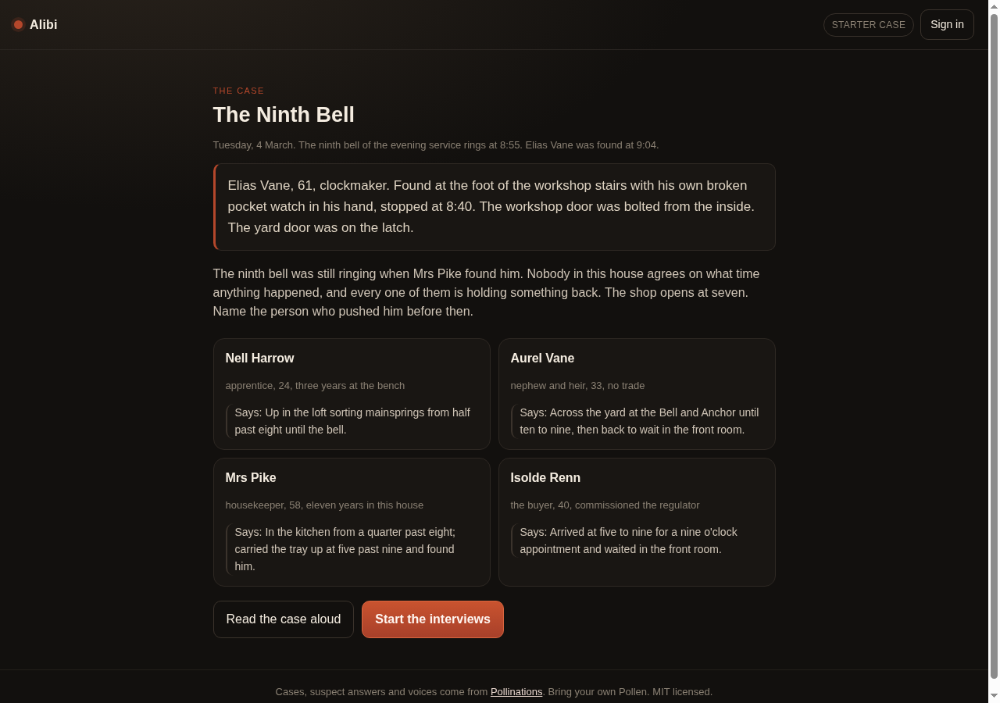
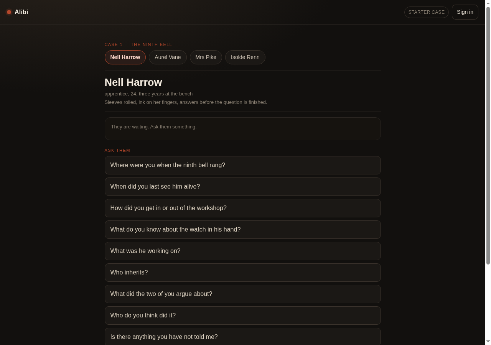
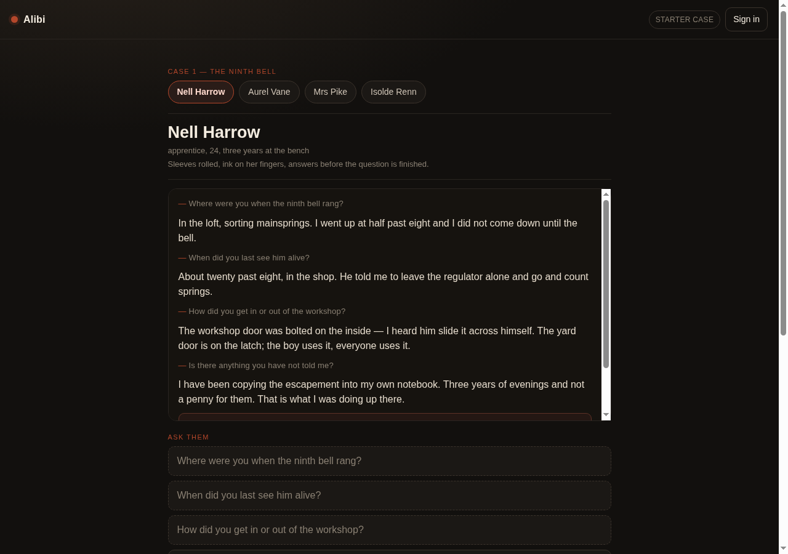
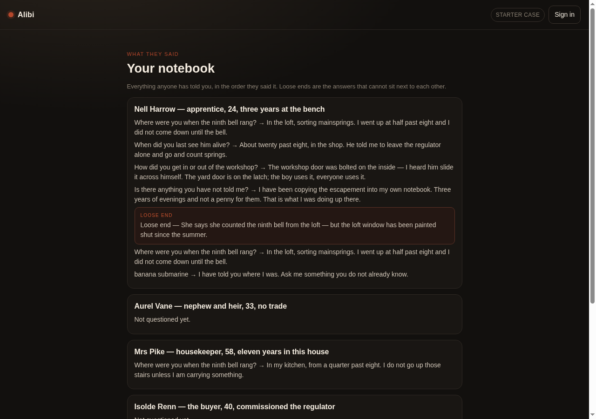
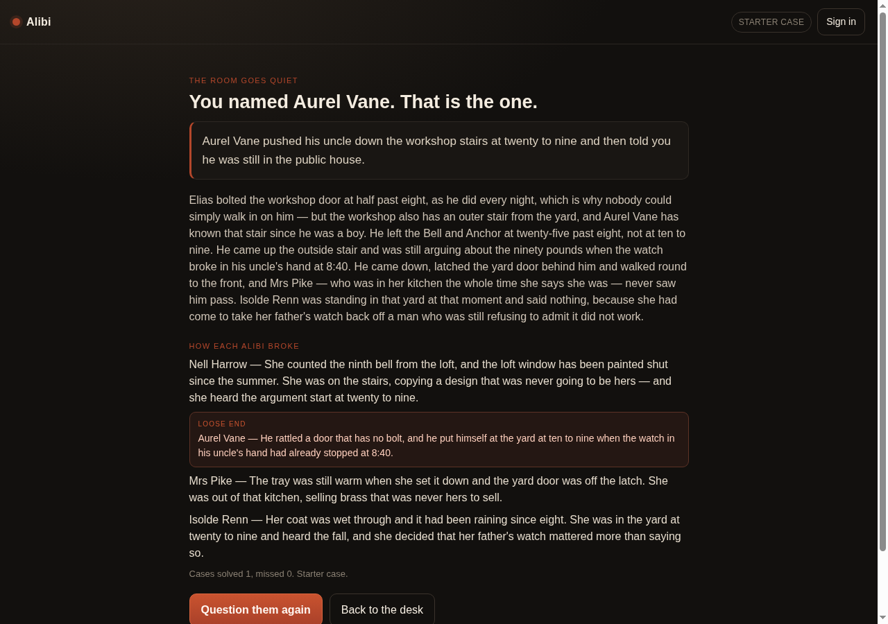

# Alibi

A voice murder mystery you question out loud. Four suspects, one evening, one
killer — and a question list that never quite gets you the whole truth.

**Play it:** https://xiaotian1171.github.io/alibi/
**Built for:** [Pollinations Quest #15724](https://github.com/pollinations/pollinations/issues/15724) — a voice murder mystery where the suspects answer you.

## Screens

| The case | The room | A loose end |
| --- | --- | --- |
|  |  |  |

| The notebook | The charge, answered |
| --- | --- |
|  |  |

## What it is

You are the detective. One case, four suspects, and a house that nobody agrees
about. You ask; they answer in character. Every suspect is holding something
back — press them three questions deep and they will finally say it, and what
they say will not fit the rest of their story. That is the loose end.

Ask out loud if you like: record a question, it is transcribed, and the suspect
answers it in their own voice. Typing works everywhere; the microphone needs a
signed-in key because the transcription is billed to you.

## How a case runs

1. **The desk** — pick the starter case or have a fresh one written, pick how
   the suspects should sound, open the case.
2. **The briefing** — where it happened, who died, and what each suspect says
   they were doing. Read it aloud if the room wants it.
3. **The room** — one suspect at a time. Nine questions on the list, and you can
   ask in your own words: offline the question is matched against the nine,
   signed in the suspect answers anything at all. Their answers stack up in the
   transcript, and the moment one of them contradicts themselves it is marked as
   a loose end.
4. **The notebook** — everyone's answers in one place, plus every loose end you
   have caught so far.
5. **The charge** — one accusation. You name the killer and the room goes quiet.
6. **The reveal** — who did it, how it was done, and how each alibi broke.

## Offline and signed in

- **Offline (no sign-in):** one complete starter case — *The Ninth Bell*, four
  suspects, all nine questions answered in character for every one of them, the
  device's own voice, no network at all. A typed question is matched against the
  nine on the list.
- **Signed in (bring your own Pollen):** the host writes a new case each time,
  the suspects answer questions that are not on the list, you can ask out loud,
  and each suspect speaks with a different Pollinations voice.

## Bring your own Pollen

The suspect answers, their voices and the transcription of your spoken questions
run on **your own Pollinations balance** — never on mine. Sign in with the
OAuth authorization-code flow with PKCE (no client secret, no server), or paste
a key from `enter.pollinations.ai/keys`. The key is kept in `sessionStorage` for
this tab only and is gone when you close it. The app asks for the `profile` and
`usage` scopes and shows your balance in the header.

## Run it locally

```bash
git clone https://github.com/xiaotian1171/alibi
cd alibi
python3 -m http.server 8080   # then open http://localhost:8080
```

It is plain HTML, CSS and JavaScript — no build step, no dependencies. To run it
on your own domain, register that hostname as an OAuth client id and paste it
into the sign-in drawer, or just paste a key.

## Tests

```bash
node test.mjs   # 47 checks
```

The tests cover the parts that break quietly: that the starter case is
answerable offline (every suspect answers every question on the menu, nobody
answers with the brush-off line, every suspect has something to slip on), that
pressing someone three questions deep is what loosens the last answer, that a
typed question finds the question it means, that a case written by the host is
refused unless it is complete, and that the page and the script agree on every
id and every screen — a missing wire here shows up as a blank page rather than
an error, so it is checked mechanically.

## Pollinations endpoints

| What | Where | Who pays |
| --- | --- | --- |
| The case, and every answer to a typed question | `POST /v1/chat/completions` | your Pollen |
| A suspect speaking | `POST /v1/audio/speech` | your Pollen |
| Your spoken question, written down | `POST /v1/audio/transcriptions` | your Pollen |
| Model lists, balance | `GET /v1/{text,audio}/models`, `GET /account/balance` | free |

## What it stores

Nothing on a server. The key lives in `sessionStorage` for the tab; your case
source, voice choice and model choices live in `localStorage`; the transcript,
the notebook and the score live in memory for the session. Closing the tab ends
everything.

## Cost

One case is a single chat completion, a few hundred tokens. A suspect's voice is
one short speech call per answer. Transcribing a question is one short audio
call. The starter case and the device voice cost nothing at all.

## Known limits

- The microphone and the per-suspect voices need a signed-in key; without one
  the app falls back to the device voice and the question list.
- Browser speech synthesis voices vary by platform; the per-suspect pitch and
  rate are a hint, not a performance.
- The offline starter case is one case. It is complete and replayable, but there
  is exactly one of it — a fresh case is what signing in buys you.

## Verified

Walked end to end in a real browser (Chrome on a cloud desktop, 2026-10-03) against
the deployed page: opened the case, read the briefing, questioned Nell Harrow three
times and then asked what she had not told you — which is where her loose end
surfaces — asked a question in plain words and watched it match the right item on
the list, switched to a second suspect, opened the notebook (four suspects written
up, one loose end), charged Aurel Vane and got the confession, the solution and
every broken alibi, then started a second run with a clean notebook. Every screen
was asserted visible when it should be, and the console was empty of errors. The
screenshots above are from that run.

Not covered by that run: the signed-in paths. Asking out loud, hearing the suspects
in their own Pollinations voices, and writing a fresh case all need a signed-in key,
because they are billed to the visitor's own Pollen — signed out, the app says so
instead of failing. The offline starter case, the nine-question interview, the
notebook, the charge and the reveal are all exercised above with no key at all.

## Licence

MIT.
